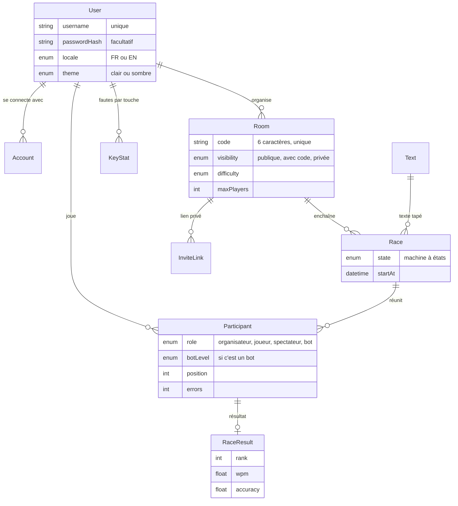
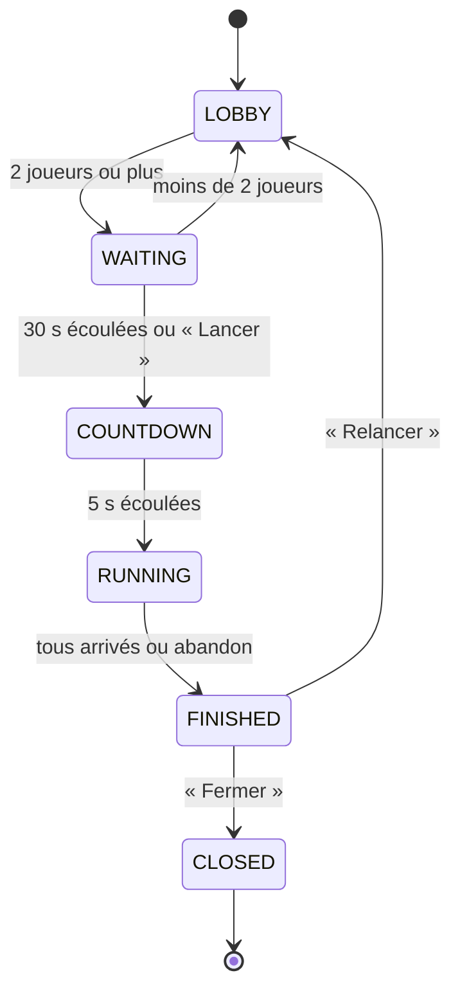

# Architecture (version initiale)

FastClap tourne sur un seul serveur Node (Next.js + Socket.IO) hébergé sur
Railway, avec une base PostgreSQL chez Neon.

## 1. Modèle de données

Une salle (`Room`) garde son code à 6 caractères et ses réglages ; chaque partie
jouée dedans est une course (`Race`), ce qui permet de relancer sans recréer la
salle. Un `Participant` relie un joueur, un invité ou un bot à une course, et son
résultat final est gardé dans `RaceResult`. Le schéma complet est dans
[`prisma/schema.prisma`](../prisma/schema.prisma), et les migrations dans
`prisma/migrations/`.

## 2. Machine à états d'une course (COURSE-01)

La course attend au moins 2 joueurs, laisse 30 s aux retardataires, compte 5 s,
puis démarre. Elle se termine quand plus personne ne tape ; l'organisateur peut
alors la relancer ou fermer la salle. Au checkpoint 1, les états LOBBY et WAITING
de la salle d'attente sont codés (`src/lib/lobby.ts`, testés avec Vitest) ; les
suivants viendront avec la course.

## 3. ADR — Temps réel avec Socket.IO

**Contexte.** Jusqu'à 30 joueurs tapent en même temps et doivent voir le rang et
la vitesse des autres en direct. Le serveur doit aussi refuser une mauvaise
lettre.

**Décision.** J'utilise Socket.IO dans le même serveur que Next.js
([`server.ts`](../server.ts)). Pendant la course, chaque touche partira au
serveur, qui la vérifiera, puis il enverra l'état de la course à tous les joueurs
10 fois par seconde. Au checkpoint 1, Socket.IO tient déjà à jour la liste des
joueurs de la salle d'attente.

**Options écartées.** Requêtes HTTP répétées (trop lentes), Server-Sent Events
(un seul sens), service hébergé comme Pusher (payant).

**Conséquences.** Il faut un serveur Node toujours allumé, d'où Railway plutôt
que Vercel. L'état des courses vit en mémoire : très rapide, mais une course en
cours est perdue si le serveur redémarre (les comptes et les salles restent dans
la base).

## 4. Approche prévue pour les bots

Les bots sont des joueurs simulés par le serveur, dans la même course que les
humains.

- **Ajout :** dans la salle d'attente, l'organisateur ajoute un bot et choisit son
  niveau (BOT-1). Le bot est enregistré comme un `Participant` avec `role = BOT`,
  un `botLevel` et aucun utilisateur.
- **Comportement :** à chaque battement du serveur (10 fois par seconde), le bot
  avance selon une vitesse cible, avec des variations, des fautes et des
  micro-pauses (BOT-2). Il passe par les mêmes règles que les humains, donc il
  doit corriger ses fautes pour avancer.
- **Sans connexion :** un bot n'a pas de navigateur ni de socket ; il apparaît
  dans le classement et les résultats comme les autres joueurs.

| Niveau        | Vitesse cible | Fautes         | Pauses   |
| ------------- | ------------- | -------------- | -------- |
| Débutant      | ~25 WPM       | fréquentes     | souvent  |
| Intermédiaire | ~45 WPM       | quelques-unes  | parfois  |
| Pro           | ~75 WPM       | rares          | rarement |
| Impossible    | ~130 WPM      | presque aucune | jamais   |

Ces valeurs seront ajustées en testant les courses.
