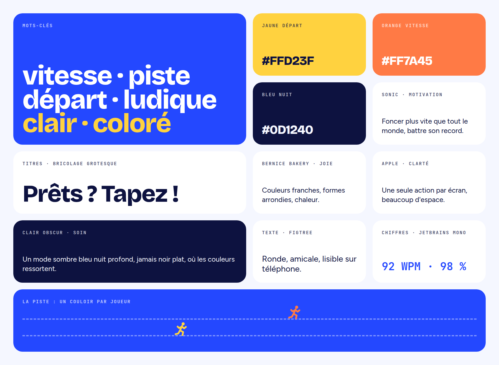
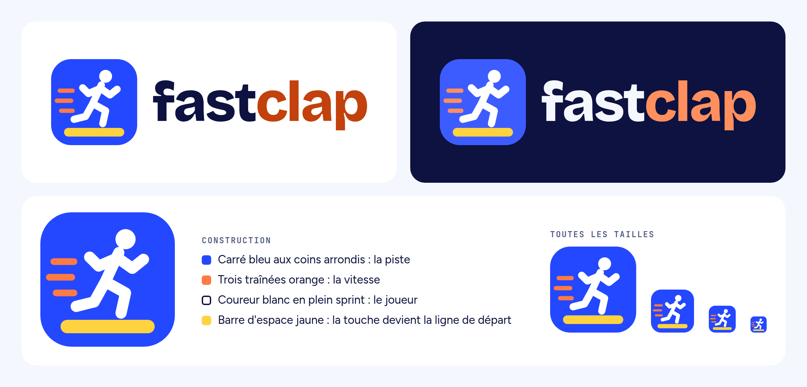
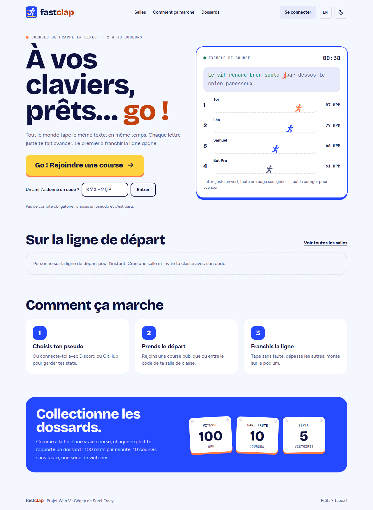
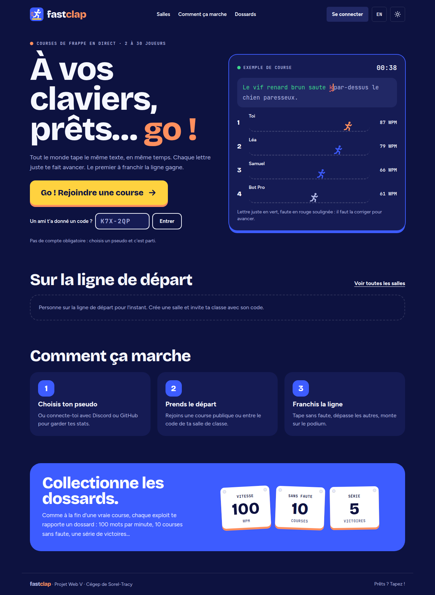
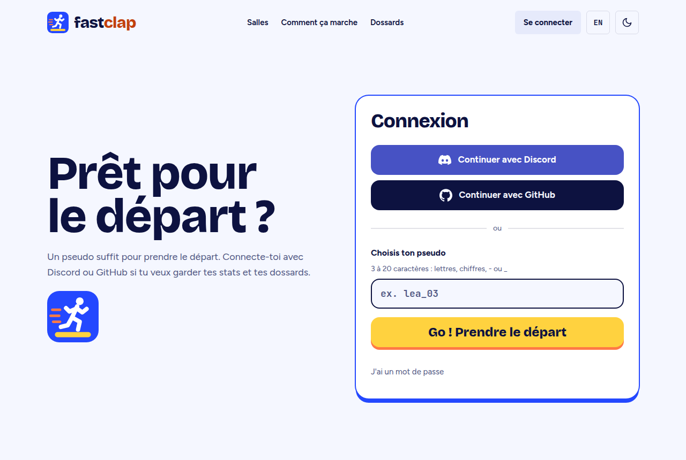
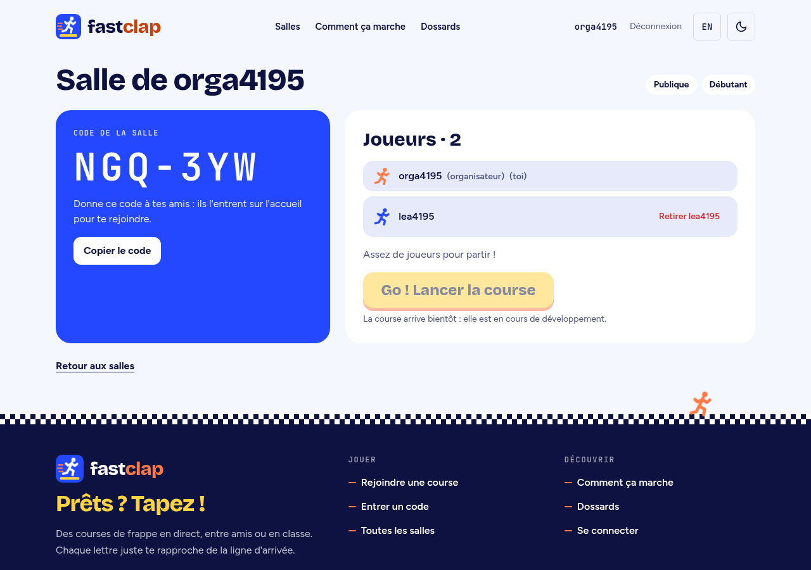
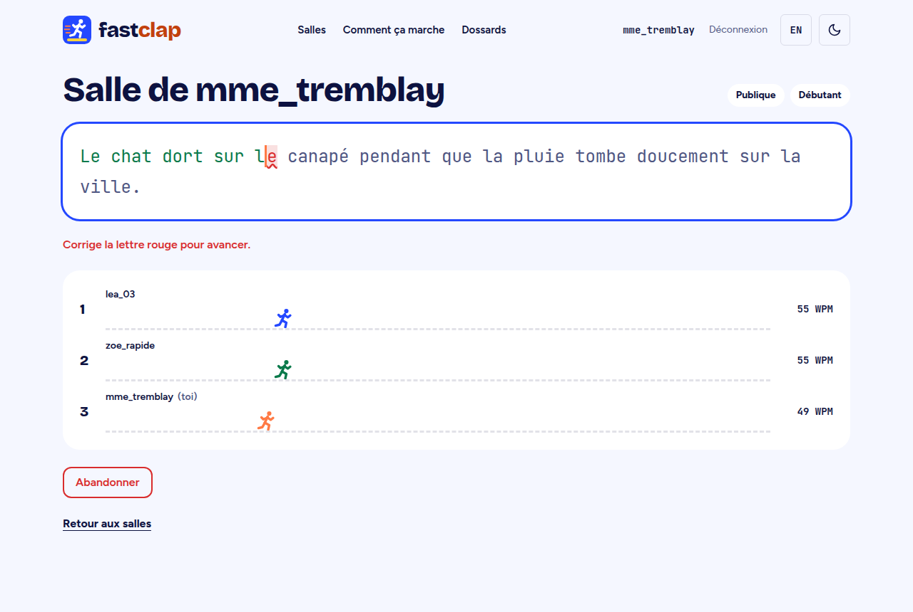
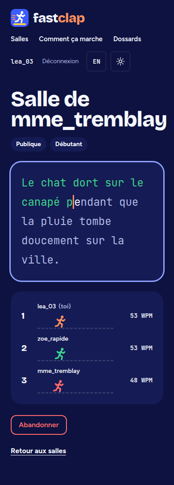

# Démarche créative et direction artistique

FastClap transforme le clavier en piste de course : un sprinteur s'élance sur
la barre d'espace, en bleu, jaune et orange, pour donner envie aux 12–17 ans de
taper plus vite.

## 1. Mon point de départ

Je voulais qu'un élève de 12 à 17 ans ait envie de s'entraîner à taper au
clavier sans avoir l'impression de faire un exercice. Pour moi, la meilleure
façon d'y arriver, c'était d'en faire une vraie course.

J'ai donc cherché à faire ressentir l'énergie d'un départ de sprint : le moment
où l'on attend le signal, puis où tout le monde s'élance. Je voulais un site
rapide, joyeux et coloré, mais qui reste clair et facile à utiliser. Je ne
voulais pas qu'il fasse enfantin, parce que des ados de 16 ou 17 ans ne s'y
reconnaîtraient pas, ni qu'il fasse sérieux comme un site d'école.

## 2. Le nom

### Noms envisagés

| Nom                    | Idée                                                      | Décision                                          |
| ---------------------- | --------------------------------------------------------- | ------------------------------------------------- |
| **FastClap**           | La vitesse et le claquement des touches                   | **Retenu**                                        |
| Clavigo                | Clavier + go : un coureur sur la barre d'espace           | Nom écarté, mais son idée de logo est gardée      |
| TapGo                  | Tap (taper) + go : une touche de clavier montée sur roues | Écarté : la voiture parle moins aux joueurs       |
| Kartouche              | Kart + touche : un drapeau à damier fait de touches       | Écarté : jeu de mots trop difficile à prononcer   |
| Typhon, Fulgur, Mach 1 | Des noms forts, qui évoquent la vitesse                   | Écartés : ils ne parlent pas de frappe au clavier |

### Pourquoi FastClap

J'ai choisi FastClap parce que le nom résume le jeu en deux mots. **Fast**,
c'est la vitesse, le but de la course. **Clap**, c'est le claquement des touches
quand on tape vite, et aussi les applaudissements quand on monte sur le podium.

J'aime que le nom soit court, qu'il se dise aussi bien en français qu'en anglais
et qu'il ait un rythme, un peu comme deux frappes de clavier. C'est un nom qu'on
retient facilement et qui donne tout de suite envie de jouer.

## 3. Ce qui m'inspire (moodboard)

Quatre références ont guidé mes choix. Je ne les ai pas copiées : j'ai pris une
idée précise dans chacune.

**Le film Sonic le hérisson, pour la motivation.** Sonic, c'est le personnage qui
ne tient pas en place et qui fonce plus vite que tout le monde. C'est exactement
l'attitude que je voulais donner au joueur : l'envie de battre les autres et son
propre record. C'est de là que vient mon idée d'un personnage qui court et des
traînées de vitesse derrière lui.

**Bernice Bakery, pour la joie.** J'aime ses couleurs franches, ses formes
arrondies et son côté chaleureux. Elle m'apporte de la bonne humeur, sans tomber
dans l'enfantin. Je lui dois mes coins très arrondis et mes dossards légèrement
penchés.

**Apple, pour la clarté.** Sur le site d'Apple, chaque page met en avant une
seule chose, avec beaucoup d'espace autour. J'ai appliqué la même règle à mon
accueil : un grand titre et un seul gros bouton, « Go ! Rejoindre une course »,
impossible à manquer.

**Clair Obscur, pour le soin.** J'aime son ambiance sombre et travaillée. Elle m'a
inspiré mon mode sombre : un bleu nuit profond plutôt qu'un noir plat, sur
lequel les couleurs ressortent.

**Mes mots-clés :** vitesse · piste · départ · ludique · clair · coloré.

## 4. Le logo

Pour le logo, je voulais une image qui dise en un coup d'œil « course » et
« clavier ». J'ai pensé à une voiture, puis à un humain qui court, et c'est le
coureur qui m'a parlé le plus : il fait penser à Sonic et chaque joueur peut s'y
identifier.

Mon idée principale : faire courir le sprinteur sur la **barre d'espace**. C'est
la plus grande touche du clavier et celle qu'on tape le plus. Dans mon logo,
elle devient la ligne de départ.

- **Le carré bleu aux coins arrondis** représente la piste. Sa forme rappelle
  aussi une icône d'application.
- **Les trois traînées orange** montrent la vitesse.
- **Le coureur blanc** est dessiné avec des traits épais et ronds pour rester
  lisible même en tout petit, dans l'onglet du navigateur.
- **La barre d'espace jaune** est la touche de départ.
- **Le nom** est écrit en minuscules, « fast » en bleu nuit et « clap » en
  orange, pour que la partie sonore du nom ressorte.

Sur le site, le coureur du logo rebondit à chaque foulée, comme s'il courait
vraiment. Le logo est dessiné en SVG (`src/components/Logo.tsx`,
`src/app/icon.svg`) : il reste net à toutes les tailles.

## 5. Mes couleurs

Je voulais sortir du noir et blanc et avoir des couleurs qui donnent de
l'énergie. J'ai construit ma palette autour de trois couleurs, chacune liée à un
élément de la course.

**Le bleu, pour la piste.** Le bleu inspire confiance et reste agréable à
regarder longtemps, ce qui compte quand on fixe un texte pendant une course.
C'est la couleur de mon logo et de ma marque.

**Le jaune, pour le départ.** C'est la couleur de la barre d'espace dans mon
logo. Je l'utilise uniquement pour l'action principale, comme le bouton « Go ! »,
parce que c'est la couleur que l'œil remarque en premier.

**L'orange, pour la vitesse.** L'orange évoque le feu et l'élan. Je l'utilise pour
les traînées du logo, pour « clap » et pour l'ombre sous les boutons jaunes, qui
leur donne l'air d'une touche qu'on enfonce.

**Le bleu nuit plutôt que le noir.** Pour le texte et le mode sombre, j'ai préféré
un bleu très foncé au noir pur : c'est plus doux pour les yeux et ça garde la
couleur de ma marque, même dans l'ombre.

| Couleur          | Mode clair | Mode sombre | Utilisation                                    |
| ---------------- | ---------- | ----------- | ---------------------------------------------- |
| Bleu piste       | `#2448FF`  | `#3D5CFF`   | Logo, étapes, section des dossards             |
| Jaune départ     | `#FFD23F`  | `#FFD23F`   | Bouton principal « Go ! »                      |
| Orange vitesse   | `#FF7A45`  | `#FF8F5E`   | Traînées, « clap », ombre des boutons          |
| Orange texte     | `#C2410C`  | `#FF8F5E`   | Mots en orange                                 |
| Bleu nuit        | `#0D1240`  | `#0D1240`   | Texte, fond du mode sombre, texte sur le jaune |
| Fond             | `#F5F7FF`  | `#0D1240`   | Fond des pages                                 |
| Surface          | `#FFFFFF`  | `#151B54`   | Cartes et formulaires                          |
| Texte secondaire | `#4F5682`  | `#B3B9E6`   | Descriptions, étiquettes                       |
| Vert             | `#0B7A4B`  | `#3DD68C`   | Lettre juste                                   |
| Rouge            | `#D92D2D`  | `#FF6B6B`   | Faute                                          |

Les couleurs sont définies une seule fois dans `src/app/globals.css` ; les
composants utilisent leurs noms Tailwind (`bg-jaune`, `text-encre`…).

**Mes règles**

1. Un seul bouton jaune par écran, pour que l'action principale soit évidente.
2. Sur le jaune, le texte est toujours bleu nuit.
3. L'orange vif sert aux formes.
4. Le vert et le rouge sont réservés aux lettres justes et aux fautes pendant la
   course.

**Lisibilité.** J'ai vérifié que tous mes textes respectent le contraste minimum
de 4,5 recommandé par les normes d'accessibilité (WCAG AA). Par exemple, le bleu
nuit sur le jaune du bouton donne 12,3, et l'orange texte sur blanc donne 5,2.
L'orange vif sur blanc ne donnait que 2,6 : c'est pour ça que j'ai ajouté un
orange plus foncé pour le texte.

## 6. Mes typographies

J'ai choisi trois polices gratuites (licence SIL Open Font), chacune avec un rôle
précis. Elles sont rangées dans le projet (`src/fonts/`).

**Bricolage Grotesque, pour les titres.** Je la trouve très grasse et pleine de
caractère, un peu comme une affiche de compétition, sans faire enfantin. Je
l'utilise pour le nom FastClap, les grands titres et le bouton « Go ! ».

**Figtree, pour le texte.** Elle est ronde et amicale, et surtout très lisible
même en petit. C'est important parce que mon public lit beaucoup sur téléphone.

**JetBrains Mono, pour les chiffres.** C'est une police à chasse fixe : chaque
caractère prend la même largeur. Pendant la course, la vitesse (WPM) et la
précision changent sans arrêt, et avec cette police les chiffres ne « sautent »
pas. Je l'utilise aussi pour les codes de salle, qu'on doit pouvoir lire sans
confondre les caractères.

| Élément                     | Police                         | Taille                   |
| --------------------------- | ------------------------------ | ------------------------ |
| Titre de l'accueil          | Bricolage Grotesque, très gras | 52 à 96 px selon l'écran |
| Titres de section           | Bricolage Grotesque, très gras | 48 px                    |
| Bouton « Go ! »             | Bricolage Grotesque, très gras | 24 px                    |
| Texte courant               | Figtree                        | 17 à 18 px               |
| Chiffres, codes, étiquettes | JetBrains Mono                 | 11 à 15 px               |

## 7. Animations et accessibilité

Je voulais que la course se voie vraiment : pendant une partie, chaque joueur a
son couloir, et son coureur avance à chaque lettre juste.

| Élément                | Ce qu'il représente pour moi | Animation                                            |
| ---------------------- | ---------------------------- | ---------------------------------------------------- |
| Couloirs en pointillés | Les couloirs d'une piste     | Les coureurs avancent selon la progression de chacun |
| Bouton jaune « Go ! »  | Une touche qu'on enfonce     | Il se soulève au survol et s'enfonce au clic         |
| Dossards               | Les récompenses d'arrivée    | Penchés, ils se redressent au survol                 |
| Damier du pied de page | La ligne d'arrivée           | Un petit coureur la franchit                         |
| Curseur clignotant     | L'endroit où l'on tape       | Il clignote chaque seconde                           |

**Penser à tout le monde.** Je voulais que FastClap soit utilisable aussi par les
personnes à mobilité réduite ou qui naviguent seulement au clavier. J'ai donc
prévu :

- des boutons et des champs d'au moins 44 px de haut, faciles à viser ;
- des messages d'erreur reliés à leur champ et lus par les lecteurs d'écran ;
- l'annonce des arrivées dans la salle, puis du départ, du rang et de la fin de
  course pour les lecteurs d'écran ;
- l'arrêt des animations quand l'appareil demande de réduire les mouvements ;
- un mode clair et un mode sombre, et une bascule français / anglais sur toutes
  les pages ;
- les vrais logos de Discord et de GitHub sur les boutons de connexion, pour
  qu'on les reconnaisse tout de suite.

## 8. Mes maquettes

Voici les principaux écrans de FastClap. L'accueil, la connexion et la salle
d'attente sont en ligne ; la course est une maquette de ce qui sera développé
après le checkpoint.

**Accueil, mode clair.** Un grand titre, un seul bouton jaune, la saisie d'un code
de salle et une petite course de démonstration pour comprendre le jeu tout de
suite.

**Accueil, mode sombre.**

**Connexion.** Discord et GitHub en premier, le pseudo seul ensuite, et le mot de
passe replié en bas, comme le demande le cahier des charges.

**Salle d'attente.** Le code à partager en grand et la liste des joueurs qui se
met à jour en direct.

**Course (maquette).** Le texte à taper, les lettres justes en vert et un couloir
par joueur.

**Course sur téléphone, mode sombre (maquette).**

